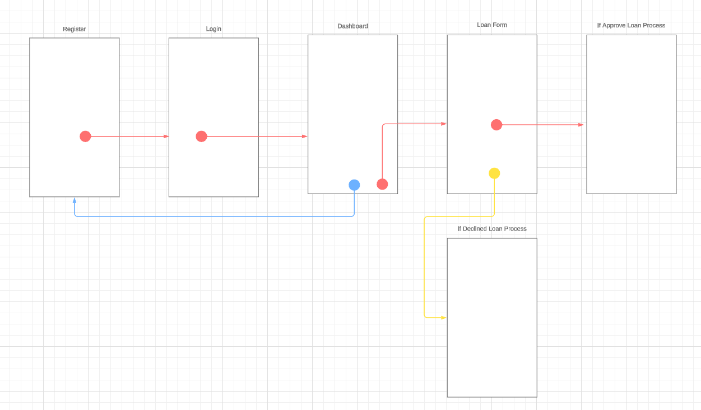

# System Analysis and Design

## High Level Design Architecture

#### Frontend
Menggunakan kerangka kerja pengembangan aplikasi seluler dengan [Flutter](https://flutter.dev/).
#### Backend
RESTful API menggunakan bahasa pemrograman [Go](https://golang.org/) dengan framework [Gin](https://gin-gonic.com/).
##### Database
Menggunakan database [PostgreSQL](https://www.postgresql.org/) untuk menyimpan data pengguna dan transaksi.
##### Authentication
Menggunakan [JWT](https://jwt.io/) untuk otentikasi pengguna.
#### Storage
Penyimpanan foto KTP pengguna dapat dilakukan di cloud storage AWS [S3](https://aws.amazon.com/s3/).
#### Notification
Pengiriman notifikasi melalui layanan pihak ketiga seperti [Firebase Cloud Messaging](https://firebase.google.com/docs/cloud-messaging).
#### Security
Penggunaan HTTPS untuk mengamankan komunikasi antara aplikasi seluler dan server.

## Design Screen Flow dan ERD
#### Screen Flow

#### ERD

## API Flow
